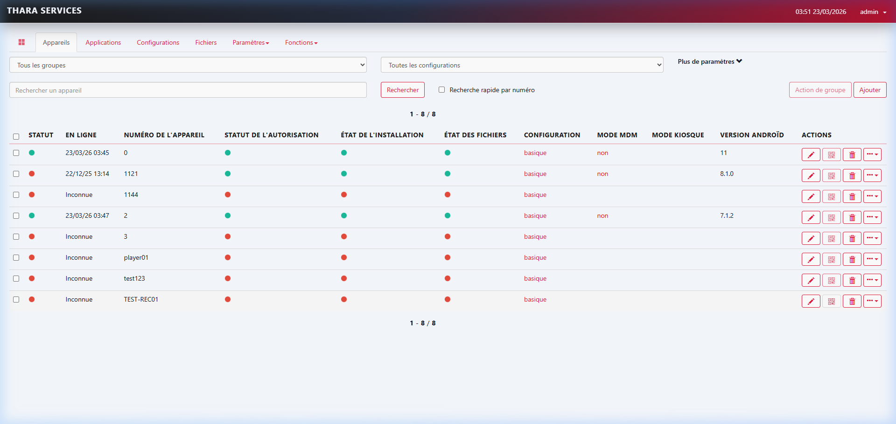
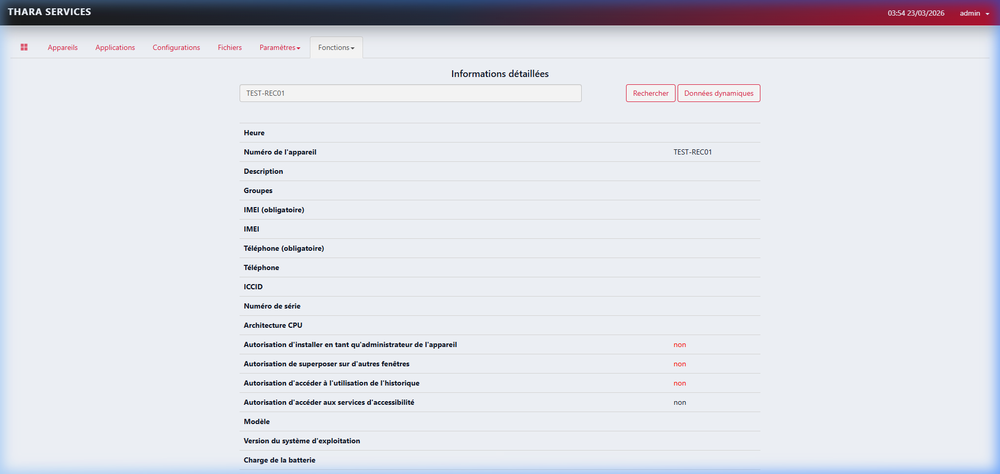
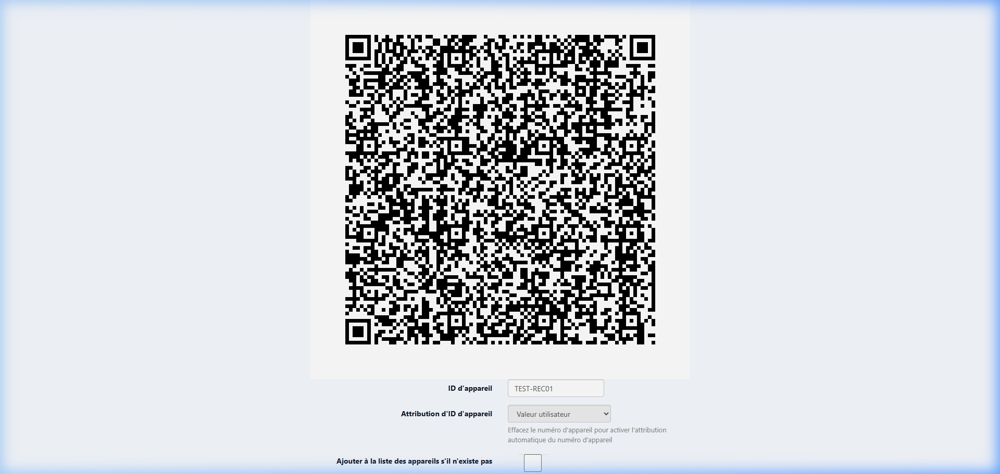
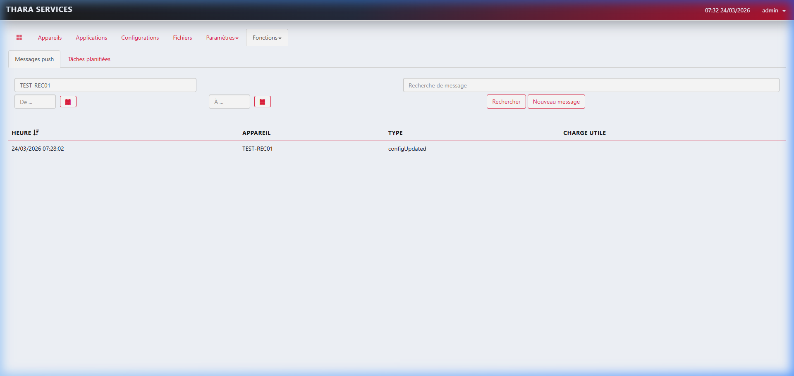

# 📱 Guide d'Administration de Master : Thara Services MDM
### Solution de Classe Entreprise pour la Sécurité et la Gestion de Flotte (HMDM)
**Version 2.5 - Mars 2026**

---

## 📑 Sommaire Analytique
1.  [Vision Stratégique de la Mobilité Sécurisée](#1-vision-stratégique)
2.  [Exigences Techniques et Réseau (Firewall)](#2-exigences-techniques-et-réseau)
3.  [Glossaire Approfondi de l'Administrateur](#3-glossaire-approfondi)
4.  [Accès, Rôles et Hiérarchie des Utilisateurs](#4-accès-rôles-et-hiérarchie)
5.  [Le Tableau de Bord (Dashboard) : Monitoring Temps Réel](#5-tableau-de-bord)
6.  [Enrôlement Android Enterprise (QR Code) : Détails Critiques](#6-enrôlement-android-enterprise)
7.  [Gestion des Configurations : L'Architecture des Profils](#7-gestion-des-configurations)
    *   7.1. Applications Autorisées (Silent Install)
    *   7.2. Branding Corporate (Identité Visuelle)
    *   7.3. Contrôle des Restrictions (MDM Settings)
    *   7.4. Déploiement de Fichiers (PDF, Logos, Bases de Données local)
    *   7.5. Permissions Applicatives Gérées
8.  [Le Catalogue d'Applications (APK) : Cycle de Vie](#8-le-catalogue-dapplications)
9.  [Gestion des Groupes et Hiérarchie des Appareils](#9-gestion-des-groupes-et-hiérarchie)
10. [Pilotage à distance : Protocoles Push et Actions Immédiates](#10-pilotage-à-distance)
11. [Sécurité Avancée : Mode Kiosque et Verrouillage Étatique](#11-sécurité-avancée)
12. [Audit, Traçabilité et Journaux de Conformité](#12-audit-traçabilité-et-journaux)
13. [Plan de Reprise d'Activité (FAQ & Dépannage)](#13-plan-de-reprise-dactivité)

---

## 1. Vision Stratégique de la Mobilité Sécurisée
Le système **Thara Services MDM** n'est pas qu'un simple gestionnaire d'inventaire. C'est le garant de la souveraineté numérique de l'entreprise. En tant qu'administrateur, vous avez le pouvoir de :
*   **Standardiser :** Garantir que chaque agent utilise les mêmes outils, à la même version.
*   **Sécuriser :** Éliminer les risques de fuites via USB, Bluetooth ou installation d'applications tierces non contrôlées.
*   **Économiser :** Réduire les coûts de support en résolvant les problèmes à distance.

La mobilité gérée permet d'augmenter la productivité de 30 % en éliminant les distractions (réseaux sociaux, jeux) et en automatisant les mises à jour logicielles.

---

## 2. Exigences Techniques et Réseau (Firewall)
Pour que les terminaux communiquent correctement avec le serveur, les ports suivants doivent être ouverts sur votre infrastructure réseau :

| Port | Protocole | Usage |
| :--- | :--- | :--- |
| **443 (HTTPS)** | TCP | Communication principale (Agent <-> Console). |
| **1883 / 8883** | TCP | Protocole MQTT pour les ordres instantanés (Push). |
| **3128** | TCP | Optionnel pour le proxy de téléchargement d'images. |

**Domaines à mettre en liste blanche :**
Pour un fonctionnement optimal sans blocage, votre pare-feu doit autoriser :
1. `mdm.thara-services.com` (Votre console)
2. `android.googleapis.com` (Services Google)
3. `play.google.com` (Pour les apps gérées)

---

## 3. Glossaire Approfondi de l'Administrateur
| Terme | Définition Technique |
| :--- | :--- |
| **Package Name** | Identifiant unique (ex: `com.whatsapp`). Indispensable pour lier l'app au MDM. |
| **Device ID** | ID de base de données. Attention : l'IMEI est différent de l'ID MDM. |
| **Wipe** | Commande "Scission d'atome" : elle efface tout, y compris l'OS si configuré. |
| **MQTT** | Le "facteur" qui livre vos ordres au téléphone en moins d'une seconde. |
| **Managed Config** | Capacité de dire à une app de se configurer seule (ex: adresse du serveur mail). |

---

## 4. Accès, Rôles et Hiérarchie des Utilisateurs
La console permet une séparation des tâches (Segregation of Duties). Vous pouvez créer des rôles spécifiques dans `Paramètres > Utilisateurs`.

*   **Administrateur Système :** Installation, mises à jour serveur, SQL.
*   **Gestionnaire de Parc :** Enrôlement, gestion des groupes, push messages.
*   **Agent de Support :** Visualisation des statuts, pas de modification possible.

*Figure 1 : Interface de gestion des accès et plugins.*

---

## 5. Tableau de Bord (Dashboard) : Monitoring Temps Réel
Le Dashboard permet de détecter les terminaux "perdus" ou "non conformes".

*Figure 2 : Surveillance de l'état de la flotte.*

**Lecture des détails d'un appareil :**
En cliquant sur un appareil, vous accédez aux indicateurs critiques (Santé batterie, Occupation stockage).

*Figure 3 : Outil de diagnostic distant.*

---

## 6. Enrôlement Android Enterprise (QR Code)
C'est la base de tout. Sans enrôlement correct, vous n'avez qu'un contrôle partiel.

### 6.1 Le mode "Device Owner"
Ce mode s'active uniquement sur un appareil **formaté (Usine)**.
1. Tapotez 6 fois l'écran "Bonjour".
2. Connectez le WiFi (ou laissez le QR code le faire).
3. Scannez.

*Figure 4 : Le QR Code magique de Thara Services.*

---

## 7. Gestion des Configurations (Architecture des Profils)
La configuration est un ensemble de règles de conformité.

### 7.1 Applications Autorisées
Ici, vous définissez le "Mur" d'applications. Tout ce qui n'est pas coché sera **DE MANIERE IRREVOCABLE** caché à l'utilisateur.

*Figure 5 : Distribution automatique des applications métier.*

### 7.2 Restrictions Matérielles (Sécurité d'État)
Vous pouvez bloquer :
*   L'appareil photo (Secret industriel).
*   L'USB Transfert (Protection contre le vol de fichiers).
*   Le Bluetooth (Sécurité réseau).

*Figure 6 : Panneau des interdictions système.*

---

## 8. Le Catalogue d'Applications (APK)
Vous gérez vos propres fichiers d'installation.

*Figure 7 : Gestion du référentiel des applications.*

---

## 9. Gestion des Groupes
Pour une flotte de 1000 téléphones, ne travaillez pas à l'unité. Créez des groupes géographiques (Douala, Yaoundé, Garoua) pour appliquer des réglages spécifiques à une région.

---

## 10. Pilotage à distance : Protocoles Push
Le menu `...` est votre télécommande.

*Figure 8 : Liste des commandes IP immédiates.*

| Commande | Rapidité | Effet |
| :--- | :--- | :--- |
| **Notification** | 1 sec | Affiche un message d'alerte. |
| **Sync** | 2 sec | Force la mise à jour des paramètres. |
| **Wipe** | 5 sec | Détruit les données de l'appareil. |

*Figure 9 : Suivi de l'exécution des ordres.*

---

## 11. Sécurité Avancée et Mode Kiosque
Le mode Kiosque transforme le smartphone en outil monolithique. L'utilisateur ne voit que VOTRE application.

---

## 12. Audit et Traçabilité
Toute modification (changement de fond d'écran, ajout d'une app) est signée par l'administrateur qui l'a réalisée.

---

## 13. Plan de Reprise d'Activité (FAQ)

**Q : L'appareil a un fond d'écran noir, pourquoi ?**
*   R : Vérifiez que l'URL de l'image est accessible.

**Q : L'utilisateur a réussi à se désenrôler.**
*   R : Impossible si le mode "no_factory_reset" était actif. L'appareil est probablement défectueux ou a été piraté physiquement (rare).

---
**© 2026 Thara Services MDM - Manuel de Formation Avancée**
*(Ce document remplace toutes les versions précédentes)* 
